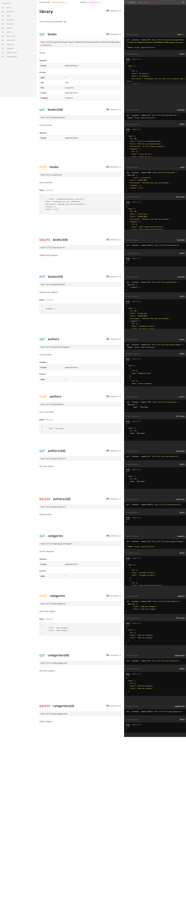

## Library REST API

This is a test case of Laravel project.

Task: Необходимо реализовать REST API для управления библиотекой. Клиент системы должен иметь возможность добавить книгу, авторов, категорию. Получать списки книг, авторов, категорий. Осуществлять поиск и сортировку книг по названию, авторам, категориям. Редактировать категории к которым относится книга.

